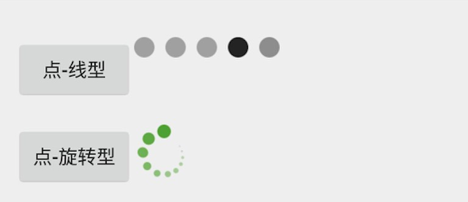

# Hopen

Hopen 女蜗，人类的缔造者，代码界的造轮者。

负责为Android App提供组件，如Loading组件、上拉加载下拉刷新组件、动画特效等。


[TOC]

## 一、Loading组件


目前放置了两个Loading效果，如图

Loading的类型在Hopen框架中以HProgressType（enum类型）区分，目前有

`HPProgressType.PointProgress` 和 `HPProgressType.PointCircleProgress`


具体使用方式如下：

```java
HProgress progress = HProgress.createDialog(MainActivity.this,HProgressType.PointProgress);
progress.show();
```


## 二、HMenuTabLayout 底部菜单栏

定义一个HMenuTabLayout

```xml
    <cn.walink.hopen.tabhost.HMenuTabLayout
        android:id="@+id/layout_menu_tab"
        android:layout_width="match_parent"
        android:layout_height="match_parent" />
```


```Java
HMenuTabLayout hMenutablLayout=(HMenuTabLayout)findViewById(R.id.layout_menu_tab);
//定义4个菜单
List menuTabList = new ArrayList<>();
        menuTabList.add(new MenuTab(this, HomeFrg.class, R.string.home, R.mipmap.ic_home_normal, R.mipmap.ic_home_selected));
        menuTabList.add(new MenuTab(this, QuotationFrg.class, R.string.quotation, R.mipmap.ic_quotation_normal, R.mipmap.ic_quotation_selected));
        menuTabList.add(new MenuTab(this, TransFrg.class, R.string.trans, R.mipmap.ic_trans_normal, R.mipmap.ic_trans_selected));
        menuTabList.add(new MenuTab(this, MyFrg.class, R.string.my, R.mipmap.ic_my_normal, R.mipmap.ic_my_selected));

//初始化菜单栏
hMenuTabLayout.init(this, menuTabList);
```


此处需实现一个接口

```java
public interface HMenuTabLayoutListener {
    public void afterClickTab(int index); //点击每个tab的事件
    public int getIconColorWhenNormal(); //正常情况显示的icon
    public int getIconColorWhenSelected(); //点击时显示的icon
}
```


## 三、HListView 下拉刷新（开发中）


## 四、HScrollView 滚动视图（开发中）


